## 🐧 Linux Process Management 

It covers essential Linux commands for monitoring and managing processes.
Each section explains what the command does, why it’s useful, and includes examples.

### Table of Contents

- Show All Processes (ps aux)
- Process Tree (pstree -p)
- Real-Time Monitoring (top)
- Adjust Process Priority (nice, renice)
- CPU Affinity (taskset)
- I/O Scheduling Priority (ionice)
- File Descriptors (lsof)
- Trace System Calls (strace)
- Find Process Using a Port (fuser)
- Per-Process Statistics (pidstat)
- Control Groups (cgroups)

#### 1. 🔍 Show All Processes

```bash
ps aux
```

- Options:
   - a → show processes for all users
   - u → show the user/owner of the process
   - x → show processes not attached to a terminal

- "ps aux" It list all the running commands on system includinng system daemons

#### Output: 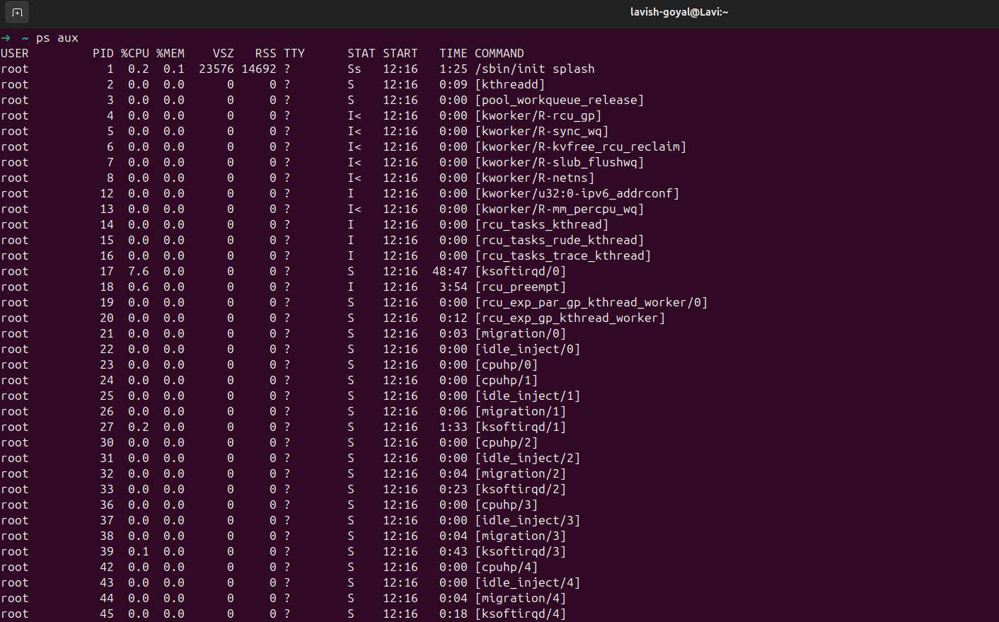
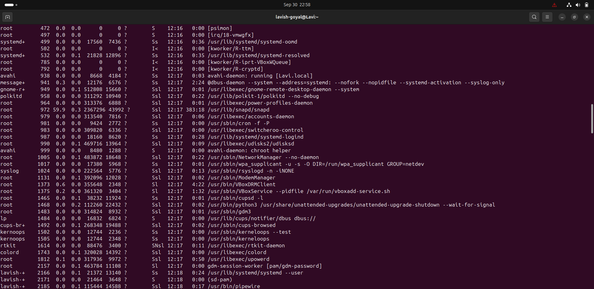
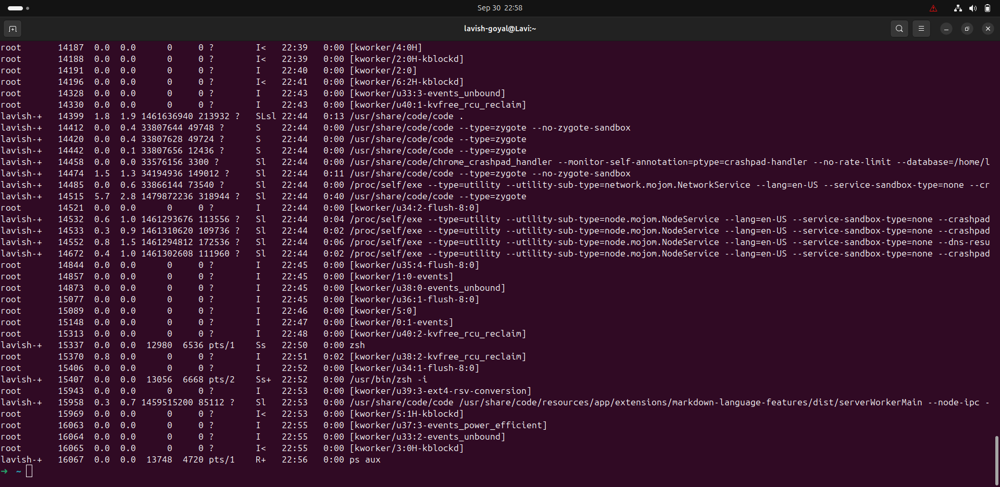

- Useful for system monitoring, troubleshooting high CPU/memory usage, or finding PIDs.

#### 2. 🌲 Process Tree

```bash
pstree -p
```

- It Shows processes in a hierarchical tree structure.
- It Helps understand parent-child relationships.

#### Output:
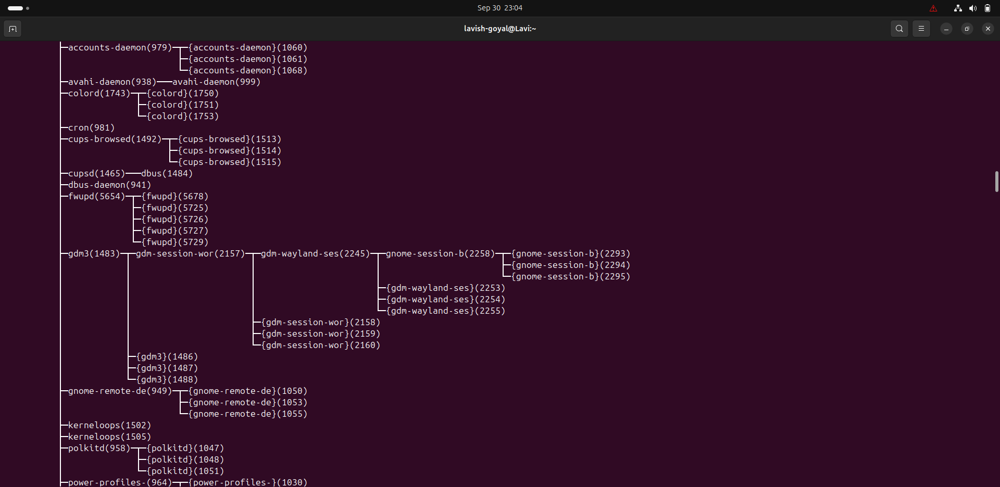
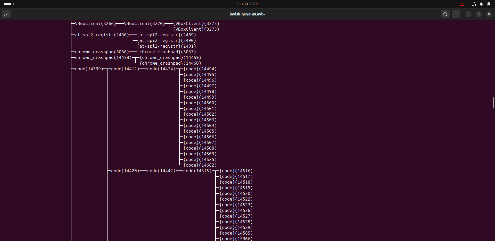
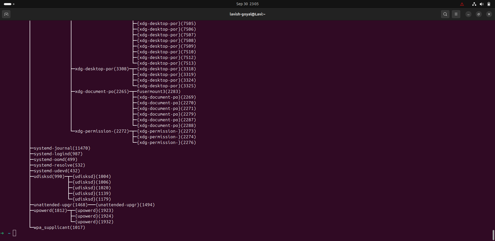

- Great for debugging orphan processes (An orphan process is a process whose parent has terminated (exited) while the child is still running.), or seeing how daemons and shells are linked.

#### 3. 📊 Real-Time Monitoring

```bash
top
```

- Interactive command to monitor CPU, memory, and tasks in real time.
- Navigation:
    - Press q → quit
    - Press k → kill a process
    - Press h → help

#### Output:
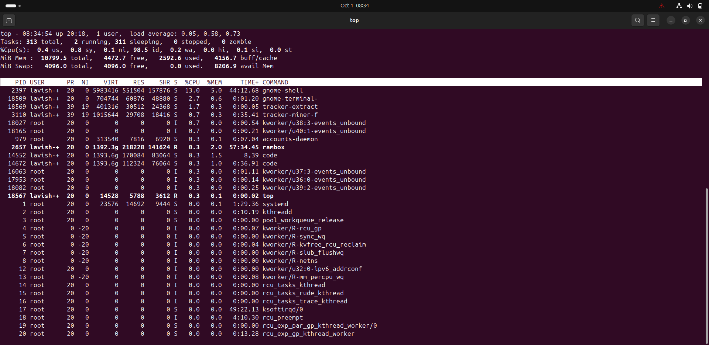

#### 4.(1) ⚡ Adjust Process Priority

- Start a process with priority

```bash
nice -n 10 sleep 300 &
```

- -n 10 → sets nice value = 10 (lower priority).
- Background job [1] 18722 created.

#### Output:
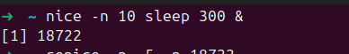

####  (2) Change priority of running process

```bash
renice -n -5 -p 18722
```

- Used when you want critical tasks to run faster or background jobs to run slower.

#### Output:
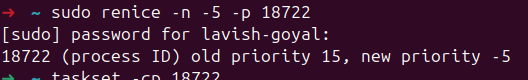

#### 5. 🧩 CPU Affinity (Bind Process to CPU Core)

```bash
taskset -cp 18722
```

- It Shows CPU cores a process can use.

#### Output:


- Restrict to core 1:

```bash
taskset -cp 1 18722
```

##### Output:
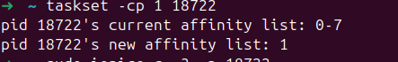

- Useful in performance tuning, ensuring tasks run on specific cores.

6. 📂 I/O Scheduling Priority

```bash
ionice -c 3 -p 18722
ionice -p 18722 (To Verify)
```

-  Controls disk I/O priority of a process.
- set pid 3050's IO scheduling class to idle

#### Output:


- Prevents background jobs (like backups) from slowing down disk access.

#### 7. 📑 File Descriptors Used by a Process

```bash
lsof -p 18722 | head -5
```

- It lists files opened by a process ie checks which files, sockets, or devices a process is using.

#### Output:
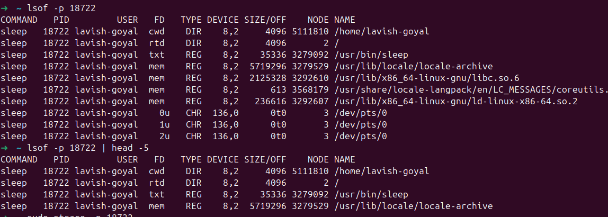

#### 8. 🐛 Trace System Calls of a Process

```bash
strace -p 18722
```

- Attaches to a process and shows system calls.

#### Output:
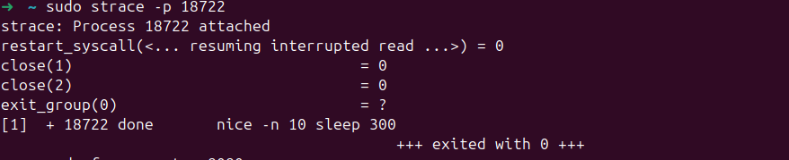

- used in debugging programs by checking file, network, and system interactions.

#### 9. 📡 Find Process Using a Port

```bash
sudo fuser -n tcp 8080
```

- system prompts to enter password
- It finds which process is bound to a TCP/UDP port.
- used in debugging web servers, databases, or services.

-  PID 18722 is using port 8080.

#### 10. 📊 Per-Process Statistics

```bash
pidstat -p 18722 2 3
```

- It displays detailed CPU usage for a process over time.
    - 2 = interval (seconds)
    - 3 = number of reports

#### Output:
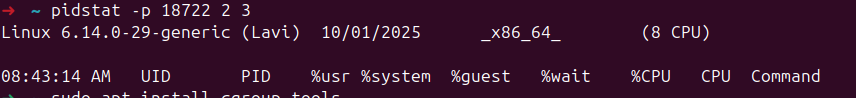

- It is usually considered better than top when monitoring one specified process

#### 11. 🔐 Control Groups (cgroups) for Resource Limits

1. Create a cgroup:

- Before proceeding to create control groups (cgroups), it is necessary to first install the relevant cgroup tools on your Linux system. These tools, such as cgcreate, cgset, and cgexec, are essential utilities that allow for the easy definition, configuration, and management of resource limits—like CPU time, memory, and disk I/O—for processes within the kernel's cgroup framework.  This prerequisite installation ensures that the commands you will use to set up and manage cgroups are available and functional.

```bash
sudo cgcreate -g cpu,memory:/testgroup
```

#### Output:
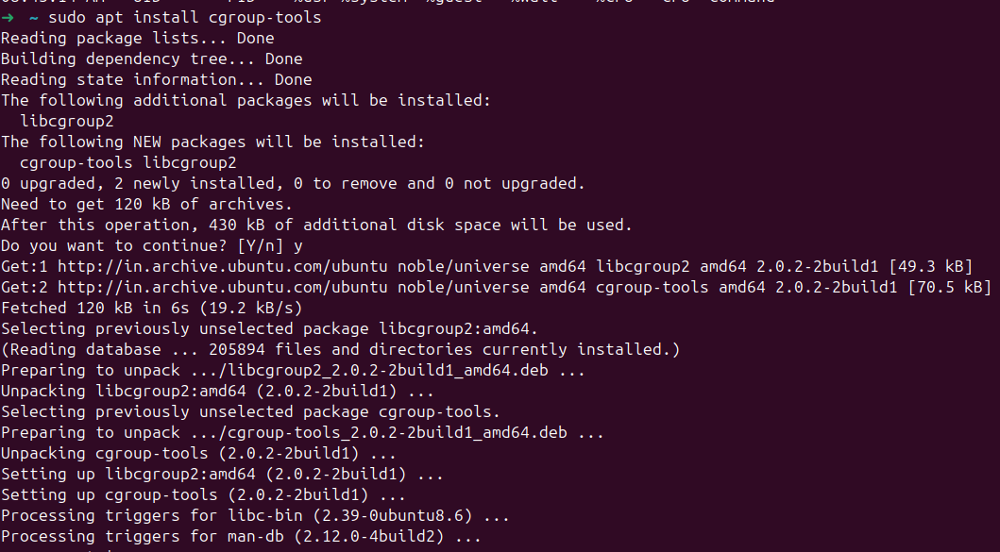

2. Limit CPU and Memory:

- First indentify if your system is running on cgroup v1 or cgroup v2
  - If running on cgroup v1,files like cpu.cfs_quota_us and memory.limit_in_bytes exist but if on v2 cpu.max,memory.max exist
- cgroup v1 or cgroup v2 can be identifed using 

```bash
mount | grep cgroup
```

#### Example:
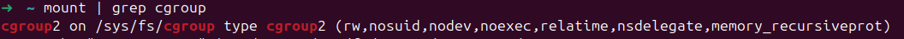
- My system is running on cgroup v2

```bash
echo "50000 100000" | sudo tee /sys/fs/cgroup/testgroup/cpu.max
echo 100M | sudo tee /sys/fs/cgroup/testgroup/memory.max
```

#### Output:
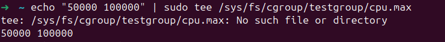


- Add process (PID 3050) to cgroup:

```bash
echo 3050 | sudo tee /sys/fs/cgroup/cpu/testgroup/cgroup.procs
```

#### Output:
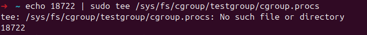

- These commands enforce resource limits on a specific process by utilizing Linux Control Groups (cgroups).  The result is that the process identified by <PID> is placed into the testgroup cgroup, where it is immediately constrained to use a maximum of 50% of a single CPU core (by setting the cpu.max value to 50000 out of 100000) and is limited to 100 Megabytes (MB) of total memory (by setting the memory.max value). This practice is crucial for resource isolation, preventing a potentially runaway or resource-intensive process from consuming all available system resources and ensuring fair sharing among all running applications.