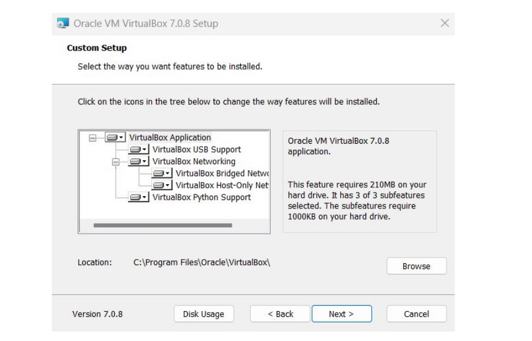
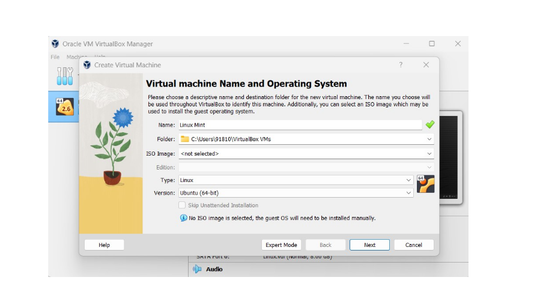
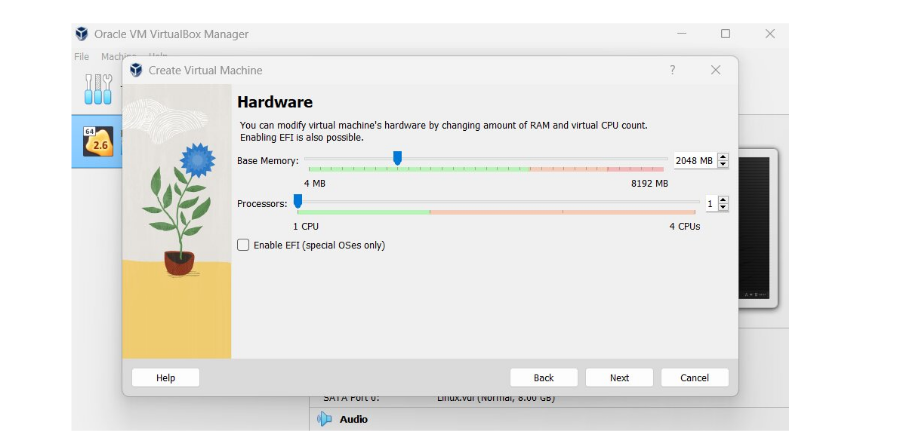

# LAB 0 : INSTALL VIRTUAL PLAYER AND LINUX

## WHAT IS LINUX ?
Linux is an open-source operating system kernel that serves as the
foundation for various operating systems, commonly referred to as
Linux distributions (or distros). Developed by Linus Torvalds in
1991, Linux is known for its stability, security, and versatility,
making it popular for servers, desktops, embedded systems, and
more.
## STEP 1 : DOWNLOAD VIRTUALBOX FILE .

    1 Go to the VirtualBox Website

    2 select your operating system
#### output :

## STEP 2 : INSTALLING VIRTUAL BOX
    
 ### 1 The beginning
 
 ### 2 select installation location
 #### output :
 

 ### 3 ready to install
#### output 

 ### 4 installation complete 
#### output 

 ### 5 opening virtualbox
#### output: 

## STEP 3 : INSTALLING LINUX USING VIRTUALBOX
### 1 Naming virtual machine

   After installing virtual box ,click New .

   – Write the Name you want for your system, for example: Linux Mint

   – Select Type: Linux.

   – Select Version: Ubuntu
   #### output 
   
### 2 select the amount of ram
#### output 

### 3 Hard Disk setting
  Select hard disk setting:

  – Choose ‘Create a virtual hard drive Now’, in order to make a virtual disk space.

  – Select the amount of hard drive size.

  -now you are done with hardware settings.

 #### output 
 
### 4 Launching your System

   Choose the downloaded Linux ISO file:

   – Click Start to launch your system
#### output :
 .png)

  - choose your iso file from your computer

### 5 Final installation

    Install Linux

    – Click Install Linux Mint:
     testf
#### output:

### Make your Account:
– Enter your details as shown below
Like as : password, username, etc.

# Finally We have successfully installed the UBUNTU LINUX .

### Q1 : what are two advantages of installing ubuntu in virtual box ?
ANS-
    > Free and open source 
    > strong security and less vulnerable to viruses 
    > Regular updates and community support.

### Q2 : Name some flavors of ubuntu.
ANS- Ubuntu Desktop,Ubuntu Sever,Kubuntu,Xbuntu,Lubuntu,Ubuntu Mate.

### Q3 : Why Ubuntu popular among the Developers ? 
ANS-  It has pre-installed development tools,supports many language, provides pacages managers(APT,Snap) , and Works well with cloud technologies.