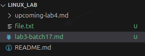

# Linux lab 3

We will be walking through basic linux command

## "ls"
### usage
    list files and directory in current folder

### snapshot

## "cd file.txt"
### usages
    open the given file

## "cd .."
### usage
    returns one step back to parent folder

## "mkdir"
### usage
    It makes new directory

## "pwd"
### usage

   shows full absolute path of the current folder
### snapshot

## "ls -a"
### usages

  list down all files and and folder incuding the current one
### snapshot

## "ls -la"
### usages

   list down all files and and folder incuding the current one in long listing format

### snapshot

## "touch file.txt"
### usages

   create new empty file

## "cp"
### usages

   copy files or dictionaries

## "mv"
### usages

   move or rename file

   mv oldname.txt newname.txt
   mv file.txt ~/Documents/     # Move file

## "rm"
### usages
   remove file
   there is no undo

    rm file.txt          # Delete file
    rm -r folder_name    # Delete folder (recursively)

## "cat file.txt"
### usages

   display content in termial

## "clear" 
### usages

   clears the terminal!!

### and some more........

